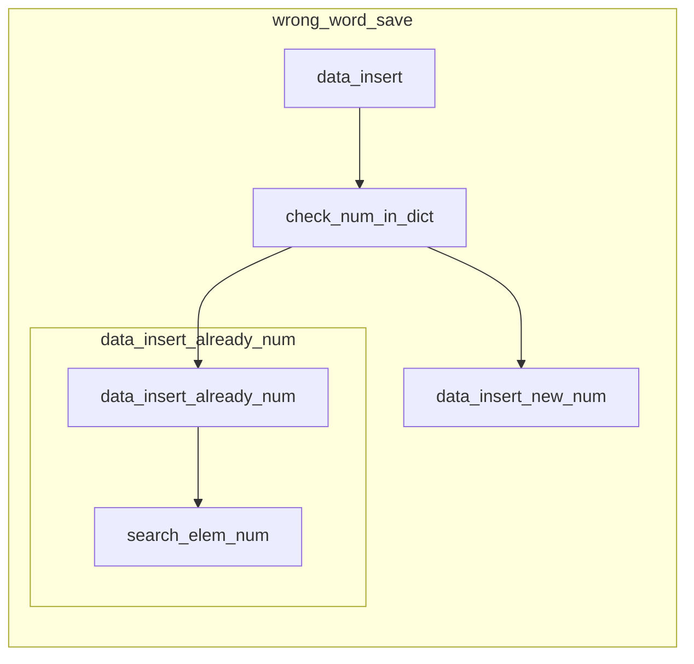

# wrong_data_save

```mermaid
    graph LR;
    A[data_insert]
    B[check_num_in_dict]
    C[data_insert_new_num]
    D[data_insert_already_num]
    E[search_elem_num]


    subgraph wrong_word_save;
    A-->B-->C
    B-->D
    subgraph data_insert_already_num;
        D-->E
    end
    end;
```