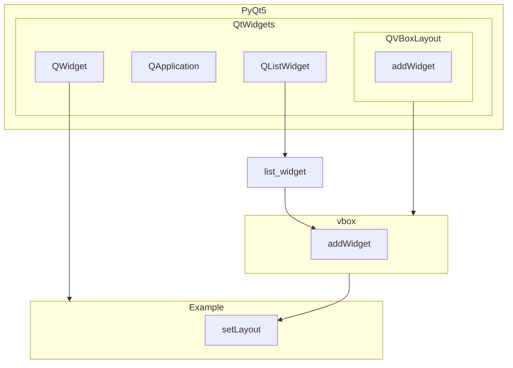

# wrong_data_save

```mermaid
graph TD;

	subgraph PyQt5
		subgraph QtWidgets
			QApplication
			QListWidget
			subgraph QVBoxLayout
			addWidget
			end
			QWidget
		end
	end
	subgraph vbox
	A[addWidget]
	end
	subgraph Example
		setLayout
	end
	QWidget --> Example
	QVBoxLayout --> vbox
	QListWidget --> list_widget
	list_widget --> A
	vbox --> setLayout
	
```